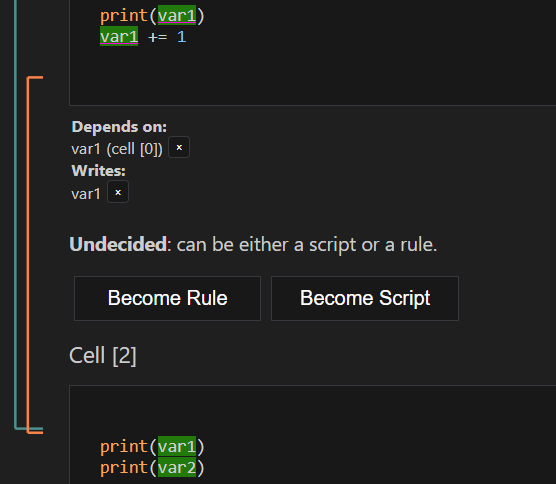

# SnakeMaker
Semi-automatic Snakemake workflow generation from unstructured Bash commands or Python Notebooks.

 
<table>
  <tr>
    <td width="70%" align="right">
      This project is financed by the Essential Open Source Software for Science Program of the Chan Zuckerberg Initiative.
      https://chanzuckerberg.com/eoss/
    </td>
    <td width="30%" align="left">
      
    </td>
  </tr>
</table>

## Table of Contents
- [General Usage](#general-usage)
- [Bash Command Support](#bash-command-support)
- [Notebook Support](#notebook-support)
- [General Snakemaker Settings](#general-snakemaker-settings)
- [Local Build and Install](#build-and-install)

# Get help interactively

Snakemaker provides a custom assistant inside the GitHub Copilot Chat. Tag *@snakemaker* to access the assistant and get help with the extension.

The Notebook feature has a separate assistant, which can be reached with the tag *@snakemaker-notebook*.

# Bash command support

## Record bash commands history
Turn on/off listening and recording of bash commands manually.

## Adding commands manually
Run `Manually add commands to Snakemaker history` to manually add commands to the history.

## Commands importance
Snakemaker distinguishes between important commands, which can contribute to the Snakemake workflow, and unimportant, one-timer commands.

Non-important commands will be shown in the Snakemaker panel in a dark-gray color, and by default they are not exported as rules. Importance of a command can be changed manually.

## Command details
Snakemaker extracts details like input/output files and possible rule names. These can be edited manually.

## Composite rules

Merge multiple commands into composite commands using drag-and-drop.

## GNU Make support

Snakemaker can also generate Make rules. The user can switch between Snakemake and Make rules generation by searching for "Rules output format" in the VSCode settings. Alternatively, ask [@snakemaker in the chat](#chat-directly-with-snakemaker) to open the setting for you.

## Rule generation options

For the Snakemake rules, some additional options are offered in the settings:
* Log directive: whether to include the log directive in the rules. Log directive is recommended in the [Snakemake best practices](https://snakemake.readthedocs.io/en/stable/snakefiles/rules.html#log-files) and is on by default.
* Prefer generic rules: when exporting multiple rules, generic rules with wildcards are preferred. This can be turned off in the settings.

Settings related to Snakemake rule generation are grouped under "Snakemake Best Practices" in the VSCode settings.

## Automatic rule validation and correction

Generated Snakemake rules are checked for errors, and fed back to the model with the error message for correction.
This feature makes rule generation more reliable, but can slow down the process and consume more tokens of the LLM API. It can be disabled in the settings: `Snakemaker: Validate Snakemake Rules`.

In order for automatic correction to work, a path to *snakemake* must be provided in the settings, or snakemake must be on the user's $PATH.
* Open the VSCode settings with `Ctrl + ,`
* Search for `Snakemaker: Snakemake Absolute Path`
* Provide the absolute path to the snakemake executable
* Leave empty to use the $PATH

## Snakemaker assistant integration in Copilot Chat
The Snakemaker custom assistant integrated in the GitHub Copilot Chat can assist in many ways during the workflow, providing help and performing operations on behalf of the user. Tag @snakemaker in the Copilot Chat to access the assistant and get help with the extension.

The direct chat can be used for a variety of purposes:

* Retrieve information about the usage of Snakemaker, troubleshooting, understand the principles of the extension.
  * *What can Snakemaker do for me?*
  * *Why aren't my commands being recorded?*
  * *How do I export my workspace?*
* Flexible rule generation.
  * *Can you generate the rule for my last command using wildcards instead of fixed filenames?*
  * *Set a ruleorder between my two commands that write to "output.txt".*
* Queries related to your own history:
  * *When did I create the file named "columns.csv"?*
  * *Do I have multiple commands generating the same file?*
* Automatically re-organize your history:
  * *Can you set all the commands writing to "output" as important?*
  * *Can you turn all the commands writing to "output" into a single composite command?*

  

## Import-export workspace

The workspace contains all the recorded commands and their details. By default, the workspace is preserved between VSCode sessions, an option that can be disabled in the settings ("Keep history between sessions").

Explicit import and export of the workspace to a JSON file can be done:

* Open the VSCode command palette with Ctrl + Shift + P 
* Search for "Snakemaker: Load Workspace" or "Snakemaker: Save Workspace"

 

# Notebook support

Open the notebook, select *More actions* (three dots), and click *Process with Snakemaker*.

## Step 1- Review data dependencies between cells

The first step in the conversion process involves resolving the data dependencies between the cells of the notebook into discrete, file-based rules.

Each cell is characterized by three sets of variables:
* **Read**: variables that the cell (might) read from other cells.
* **Write**: variables that the cell (might) write to be used by other cells.
* **Wildcards**: variables that the cell (might) read that will be provided as Wildcards.

From these sets, the dependency graph is constructed by matching each **Read** variable of a cell with the closest **Write** of this variable in the previous cells. **Wildcards** on the other hand will be mathed to patterns in the filenames during the next step, where actual rules will be generated.

In the image below, for example, Cell 1 first reads the variable *var1*, which is received from some previous cell, and then modifies it. Cell 2 also reads *var1*, but it is the modified version produced by Cell 1.

 
Snakemaker provides a first automatic resolution of the dependencies, which can be reviewed and further refined by the user.

### Split, Merge or Remove Cells.

Each Cell will become either a Snakemake rule or a script that will be imported by other scripts or rules. The user can split, merge or remove cells to better fit the workflow.

### Manually add or remove variables from the Read, Write and Wildcards sets.

Dependencies can be added by selecting a variable in the code and clicking on the context buttons that appear.

Similarly, variables can be removed from the sets by clicking on the X buttons displayed next to them under the cell's code.

### Set cells as Rules or Scripts

Under each cell, buttons are provided to set its state as a **Rule** or a **Script**, with an additional option **Undecided**, indicating cells for which a decision hasn't been taken yet.

Cells' states are constrained by the states of the cells they depend on. In particular:
* A **Rule** can read output files from other rules and can import scripts, so it can depend on both **Rules** and **Scripts**. This means, every cell can become a **Rule**.
* A **Script** can import other scripts, but can not directly read output files from another rule, so it can depend only on **Scripts**. This means, setting a cell as a **Rule** might have a cascading effect on other cells set as **Scripts**, forcing them to become **Rules** as well.

### Finalize first step

In order to continue to the next step, all dependencies must be resolved, and all cells must be set either as a **Rule** or a **Script**. Unresolved dependencies and undecided cells are shown at the top of the panel.

## Step 2- Review generated code and Snakemake rules

In the second step, Snakemaker uses the information provided in the first step to automatically generate the Snakemake workflow. This process involves code generation.
* A **prefix code** is generated for each cell. This code manages the import statements, the reading of command line arguments, and the reading of input files.
* A **suffix code** is generated for the **Rules**. This code manages the writing of output files.
* Snakemake rules are generated for each cell set as a **Rule**.

In this step the user can review the generated code, and make modifications to it.

### Modify the generated code, auto-propagate changes.

The user can modify the generated code on the cells as in a regular editor. Changes are fed to the LLM, which will propagate them to the following cells, if necessary.

For example, if the user modifies the suffix of a cell to write the output file with a different format, the LLM will automatically:
* Update the Snakemake rule with the correct output filename.
* Update the Snakemake rule and prefix code of the cells that read this output file.

### Export the workflow

When the user is satisfied with the generated code, he can export the workflow. A directory where to save the Snakefile and the scripts will be asked.

## Use the Snakemaker-Notebook assistant to get help and perform large operations

The process described above can be performed manually using the GUI. However, a more efficient way is to use the Snakemaker-Notebook assistant, which can be reached by tagging *@snakemaker-notebook* in the Copilot Chat.

The assistant can answer prompts regarding the current state of the process, identify issues, provide suggestions to fix them or fix them directly, and perform batch operations from natural language, such as changing the output format of all the rules, or the output directory, set outputs as temp etc. The user is encouraged to engage with the chat agent to get help with the entire process.

  

<table>
  <tr>
    <td width="50%">
      
    </td>
    <td width="50%">
      
    </td>
  </tr>
</table>

# General Snakemaker settings

## Change language model

A model selection panel is provided at the bottom of the Snakemaker panel.

Double-click on a model to activate it.

### Add custom model

Custom models can be added if they support OpenAi API standards. In order to add a custom model:
* Click "Add Model" in the Model panel.
* Provide the model's URL.
* Provide the model's API key, or leave it empty if the model is free to use (i.e. locally hosted models).
* Provide the model's name, required by the OpenAi API.
* Provide the maximum tokens the model can consume in a single request.

# Build and install extension for local usage
* Clone the repository: "git clone https://github.com/molinerisLab/snkmaker.git"
* Set version: open "package.json", modify field "version"
* Build: "npx @vscode/vsce -- package". Produces a *.vsix file.
* Install: from VSCode, open the "Extension" sidebar, click on the three dots on the top-right corner of the sidebar, click Install from VSIX.
