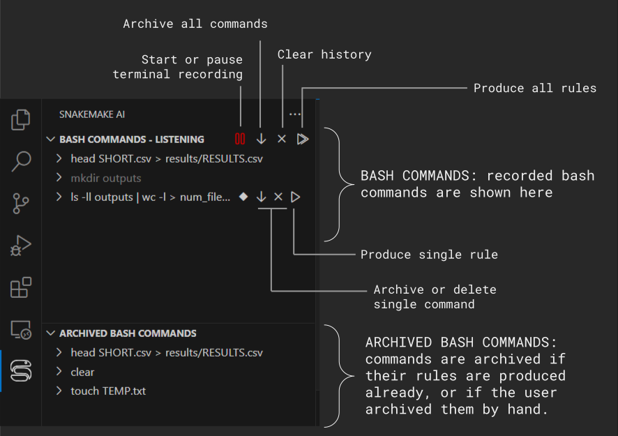

# SnakeMaker
convert bash/r/python history or unstructured code in snakefiles

# Build and install extension for local usage
* Set version: open "package.json", modify field "version"
* Build: "npx @vscode/vsce -- package". Produces a *.vsix file.
* Install: from VSCode, open the "Extension" sidebar, click on the three dots on the top-right corner of the sidebar, click Install from VSIX.

# Chat directly with Snakemaker
Snakemaker integrates with the Github Copilot chat, allowing the user to chat directly with the extension. The direct chat can be used for two sets of purposes:

* Retrieve information about the usage of Snakemaker, troubleshooting, understand the principles of the extension.
    * Examples: 
        * *What can Snakemaker do for me?*
        * *Why aren't my commands being recorded?*
        * *How do I export my workspace?*
        * *What language models can Snakemaker use?*
* Run custom prompts on your command history.
    * Examples: 
        * *When did I create the file named columns.csv?*
        * *Can you write a Snakemake rule for my last command that uses wildcards instead of a hardcoded output?*
        * *Are there repetitions in my last commands?*

# General Usage

### Snakemaker panel overview 

### Record bash commands
Snakemaker isn't always recording bash commands. Recording can be started and paused by hand.

### Commands importance
When recording bash commands, Snakemaker tries to distinguish between important commands, which can contribute to the Snakefile, and unimportant, one-timer commands, which are not.

Non-important commands will be shown in the Snakemaker panel in a dark-gray color, and by default they are not exported as rules. Importance of a command can be changed manually

### Command details
When recording a bash command, Snakemaker tries to extract some details:
* Input files required by the command
* Output files produced by the command
* Possible name for a corresponding rules

These details can be edited manually for better rules production. 

### Composite rules

By default, Snakemaker proposes one candidate rule for each important bash command recorded. If the user whishes for multiple commands to be considered for a single snakemake rule, he can use drag-and-drop to merge commands into composite commands.

### Import-export workspace

The workspace - intended as the collection of recorded and archived commands, together with their additional information, will be lost when VSCode is restarted.

In order to preserve it, the workspace can be saved to a file and re-loaded.

* Open the VSCode command palette with Ctrl + Shift + P 
* Search for "Snakemaker: Load Workspace" or "Snakemaker: Save Workspace"

### Change language model

A model selection panel is provided at the bottom of the Snakemaker panel.

Double-click on a model to activate it.